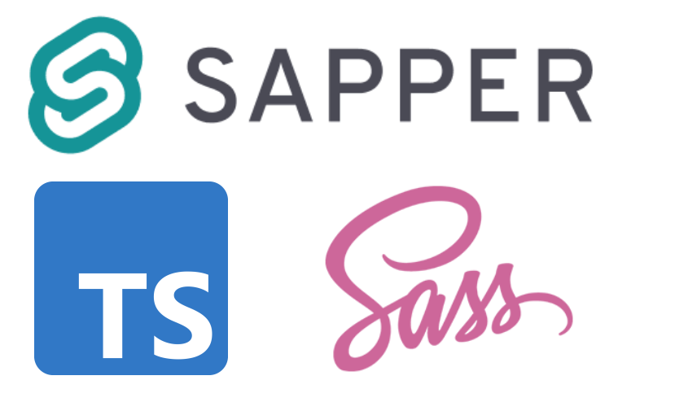

# DSM-Github_Rank

DSM gituhb rank service by contributions.

dsmgr은 대덕소프트웨어마이스터고등학교의 Github기여도를 표시합니다

⚠️ 학생의 동기부여 목적으로 제작되었습니다.

## 안내사항

- 대덕소프트웨어마이스터고등학교 재학생 대상입니다.
- `@dsm.hs.kr`으로 끝나는 이메일로만 가입 가능합니다.
- 본인의 Github ID를 포함해 계정 등록에 성공하면 리스트에 표시됩니다.
- 비공개 저장소를 기여도로 표시하면 모든 기여도를 확인할 수 있습니다.(Github설정)
- 데이터는 [api](https://github.com/la-crima/git-rank-api) 서버를 통해 12시간 마다 동기화 됩니다.
- 만약 잘못된 정보로 기입시 관리자가 임의로 삭제할 수 있습니다
- 사용자 정보 수정 및 삭제는 제작자로 요청해주세요.
- 버그 제보 및 문의사항은 [이슈 저장소](https://github.com/DSMGR/suggestion)를 이용해주세요.

## 사용 기술

### 프론트엔드

[Sapper](https://github.com/sveltejs/sapper/blob/master/README.md), Scss, PostCSS, TypeScript를 사용하여 프론트엔드를 제작하였습니다

## Project

- This project is made by [sveltejs/sapper-template](https://github.com/sveltejs/sapper-template).

## Reference

- https://beomy.github.io/tech/svelte/start-svelte/
